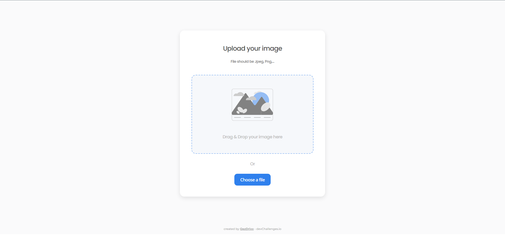

<!-- Please update value in the {}  -->

<h1 align="center">Image Uploader</h1>

<div align="center">
   Solution for a challenge from  <a href="http://devchallenges.io" target="_blank">Devchallenges.io</a>.
</div>

<div align="center">
  <h3>
    <a href="https://{your-demo-link.your-domain}">
      Demo
    </a>
    <span> | </span>
    <a href="https://github.com/QazDrixx/image-uploader-master">
      Solution
    </a>
    <span> | </span>
    <a href="https://devchallenges.io/challenges/O2iGT9yBd6xZBrOcVirx">
      Challenge
    </a>
  </h3>
</div>

<!-- TABLE OF CONTENTS -->

## Table of Contents

- [Overview](#overview)
  - [Built With](#built-with)
- [Features](#features)
- [How to use](#how-to-use)
- [Contact](#contact)

## Overview



### Built With

- [React](https://reactjs.org/)
- [SCSS](https://sass-lang.com/)
- [Flask](https://flask.palletsprojects.com/en/2.3.x/)
- [Vite](https://vitejs.dev/)

## Features

This application/site was created as a submission to a [DevChallenges](https://devchallenges.io/challenges) challenge. The [challenge](https://devchallenges.io/challenges/O2iGT9yBd6xZBrOcVirx) was to build an application to complete the given user stories.

## How To Use

To clone and run this application, you'll need [Git](https://git-scm.com), [Node.js](https://nodejs.org/en/download/) (which comes with [npm](http://npmjs.com)) and [Python](https://www.python.org/) installed on your computer. From your command line:

```bash
# Clone this repository
$ git clone https://github.com/QazDrixx/image-uploader-master.git

# Install dependencies for frontend part
$ npm install

# Create a virtual enviroment for backend part
For Windows: $ python -m venv .venv
For Unix/Linux: $ python3 -m venv .venv

#Activate the virtual environment
For Windows: $ .venv\Scripts\activate
For Unix/Linux: $ source .venv/bin/activate

# Install dependencies for backend part
$ pip install -r backend/requirements.txt

# Run the backend part
$ cd backend
$ flask --app app run --debug

# Run the app
$ npm run dev
```

## Contact

- GitHub - [@QazDrixx](https://{github.com/your-usermame})
- Telegram - [@QazDrixx](https://t.me/QazDrixx)
