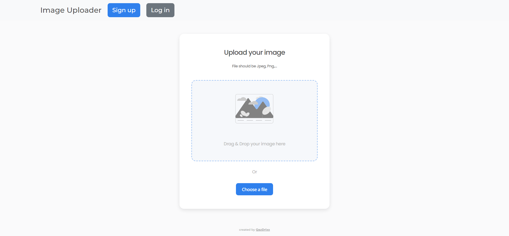

<h1 align="center">Image Uploader</h1>

<div align="justify" style="font-size: 16px">
   This web-application allows users to easily upload images by dragging and dropping or selecting from folders, with a visual loader indicating the upload progress. Registration is mandatory for accessing the service and involves a unique username and email, with password validation. Secure authentication is implemented using JWT tokens. Users can manage their uploaded images, including viewing, filtering, searching, favoriting, renaming, and deleting them.
</div>

<div align="center" >
  <h3>
    <a href="https://image-uploader-master-iota.vercel.app/">
      Demo
    </a>
    <span> | </span>
    <a href="https://github.com/QazDrixx/image-uploader-master">
      GitHub
    </a>
  </h3>
</div>


## Table of Contents

- [Table of Contents](#table-of-contents)
- [Overview](#overview)
  - [Built With](#built-with)
- [Features](#features)
- [How To Use](#how-to-use)
- [Contact](#contact)

## Overview



### Built With

- [React](https://reactjs.org/)
- [SCSS](https://sass-lang.com/)
- [React Bootstrap](https://react-bootstrap.netlify.app/)
- [Vite](https://vitejs.dev/)
- [NodeJs](https://nodejs.org/)
- [ExpressJS](https://expressjs.com/)
- [MongoDB](https://www.mongodb.com/)
- [Mongoose](https://mongoosejs.com/)

## Features

1. **Image Upload:**

   - Users can drag and drop their images to upload.
   - Users can choose to select images from their folders.
   - Users see a loader indicating the upload process.

2. **User Authentication:**

   - Users must register to access the service.
   - Registration requires a unique username and email.
   - Password validation includes requirements such as a minimum length and complexity.
   - If a user successfully registers, the site notifies them of the successful registration.
   - In the case of any registration or login issues, such as duplicate usernames, emails, or incorrect login credentials, the user is promptly informed of the problem.
   - Access and refresh tokens are used for secure authentication.

3. **Image Management:**

   - Users can view all their uploaded images.
   - Users can filter their images by upload date and alphabetically.
   - Users can search among their uploaded images.
   - Users can add images to their favorites.
   - Users can rename their uploaded images.
   - Users can delete their uploaded images.

## How To Use

To clone and run this application, you'll need [Git](https://git-scm.com), [Node.js](https://nodejs.org/en/download/) (which comes with [npm](http://npmjs.com)) installed on your computer. Also you'll need a [MongoDB Database](https://www.mongodb.com/).

1. **Create a .env file in the project's root folder and add the following variables to it:**

   - DB_URI - URI to connect to your MongoDB server.
   - ACCESS_SECRET_KEY - The secret key for creating an access token, It could be a random string.
   - REFRESH_SECRET_KEY - The secret key for creating a refresh token, It could be a random string.
   - FRONTEND_URL - Your URL for frontend.
   - VITE_BACKEND_API_URL - Your URL for backend.
   - PORT - Backend port. By default, it's 4444.

2. **For development, enter the following commands in your command line:**

```bash
# Clone this repository
$ git clone https://github.com/QazDrixx/image-uploader-master.git
$ cd image-uploader-master

# Install dependencies
$ npm install

# Run the backend part
$ npm run backendDev

# Run the fronend part
$ npm run dev
```

## Contact

- GitHub - [@QazDrixx](https://{github.com/your-usermame})
- Telegram - [@QazDrixx](https://t.me/QazDrixx)
